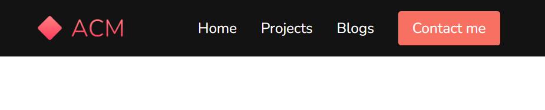

# ACM Portfolio Website Workshop

This is the navbar exercise for the workshop. The HTML and skeleton CSS are given to you, try to match the following image!

## Slides: [acmurl.com/webport-slides](https://acmurl.com/webport-slides)

*Based on [this website](https://github.com/briancodex/html-css-website-v1) by [briancodex](https://github.com/briancodex)*

